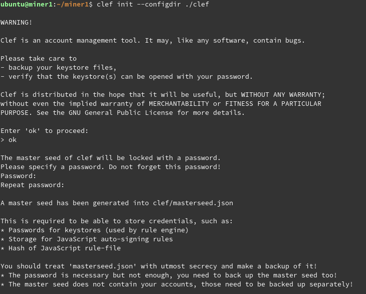
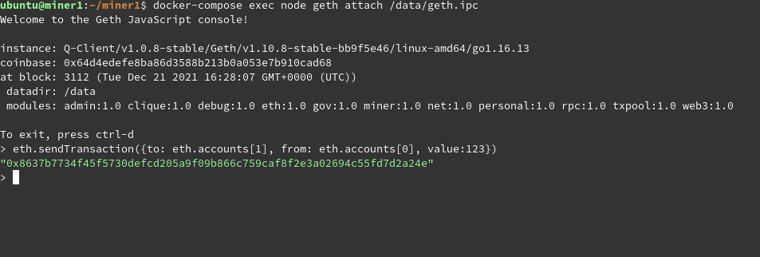
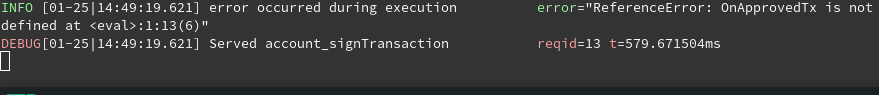
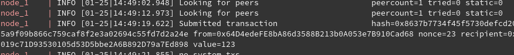
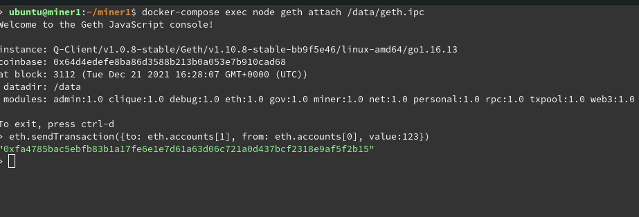
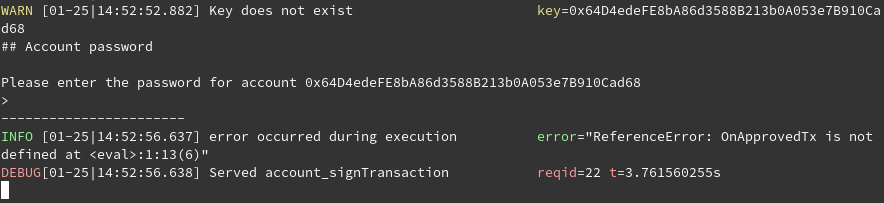

# Clef Tutorial

### initialization
First, you need to init clef dir to create masterseed

```text
# CLEFDIR - directory with clef data (default: $HOME/.clef)
$ clef init --configdir CLEFDIR
```




### "Unlocking" keystore
Then you should COPY your keystore file to keysotre folder
and add password to clef

```text
$ cp keystoreFile KEYSTOREDIR
$ clef setpw --configdir CLEFDIR 0x123dead #password will prompted and decrypted by masterseed
```

### Rules
To accept or reject some requests create rule file:

```text
function ApproveListing() {
    return "Approve"
}
function ApproveTx(){
        return "Approve"
}
```

and then add checksum of rules file to clef

```text
$ clef attest --configdir CLEFDIR $(sha256sum rules.js)
```

### Start service

```text
$ clef --configdir CLEFDIR --keystore KEYSTOREDIR --chainid=35441 --rules=/data/rules.js
```

then you can use clef as signer in geth

```text
$ geth ...YOUR FLAGS... --signer=CLEFDIR/clef.ipc
```

More info about clef can be found in the offcial [docs](https://geth.ethereum.org/docs/clef/tutorial).

# Demo

### sending tx with "unlocked" account






### sending tx from "locked" account
rm password from clef

```text
$ clef --configdir=CLEFDIR $address
```



password prompted in clef


