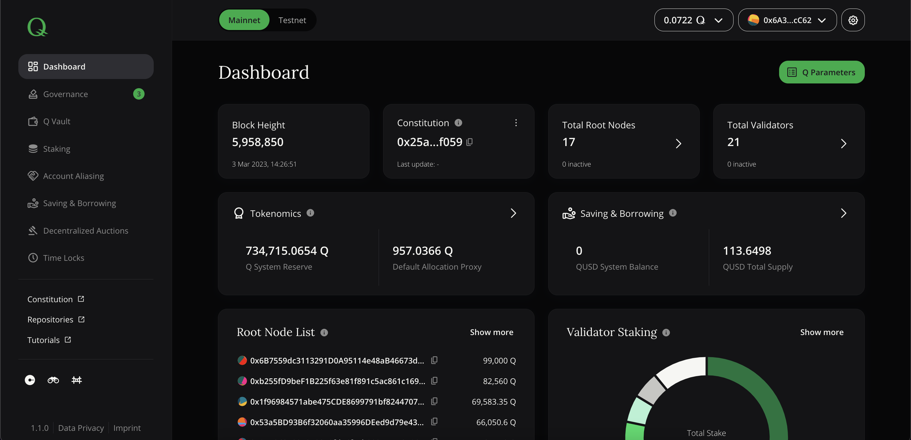

# Your HQ dApp

## What is "Your HQ"?

The easiest way to interact with the Q network is to use the dApp *Your HQ*. It consists of a GUI that is integrated with the Q smart contracts through a JS SDK. It is open source and can be found on the Q project [gitlab](https://gitlab.com/q-dev). One publicly available UI instance is hosted at [https://hq.q.org/](https://hq.q.org/). You will need to have a running MetaMask wallet plug-in before being able to interact with the relevant delegation smart contract through *Your HQ*. Please check the [MetaMask tutorial](how-to-install-metamask.md) first.

The following chapters explain the main purpose for each dApp section and give background information on how to interact with Q system.

## General components and layout

The dApp has been designed like a regular webpage. It is split into a navigation bar ("navbar") on the left side of the screen and a content area on the right side.

*Screenshot of dApp: General components*

The bottom of the navbar consists of "References" with links to project homepage, repositories and this tutorial homepage.

Underneath these references, the current wallet address (the one that is selected in MetaMask) is displayed. A left mouse click will copy the address into cache.

Additionally, the icon for settings as well as for version information can be clicked. Settings allow to switch between dark and light theme as well as between basic and advanced mode. Basic mode hides complex functionality that should be irrelevant for basic users, such as root or validator node staking or managing decentralized auctions. Advanced mode offers all available features. This tutorial is written and aligned with advanced mode.

> **Note: ** *If you are missing some features in navbar, make sure you are using advanced mode!*

The version information might become useful when you are using different UI versions for testing purposes. The dApp source code is updated and enhanced regularly. The version tag shows the current version that is running, a click on it will show a modal with all integrated and running components in the background.

> **Note: ** *When posting a bug report, please ensure to enclose a full version information.*

## Dashboard

The dashboard contains the most important information of Q system separated into different groups:

| **Box title** | **Values & description** |
|:--|:--|
| Blockchain | Current blocksize with latest block validated and system contract registry address |
| Constitution | Hash and download of current constitution as well as all former versions |
| Governance | Count of active and passed proposals |
| Tokenomics | Live overview of all proxy balances and CTAs for triggering token allocation according to Q token economics |
| Saving & Borrowing | KPIs of native DeFi app |
| Root Node Panel | List of elected and active Root Nodes |
| Validator Ranking | List of highest ranked Validator Nodes |
| List of DeFi Experts | Expert panel taking care of Q DeFi parameters and tokenomics |
| List of Q Fees & Incentives Experts | Expert panel taking care of Q fee and rewards parameters |

The button `Q Parameters` on the top right leads to a sub-page of dashboard that contains a list of all current system parameters and contract addresses. This is extremely helpful for both developers and experts of different expert panels.

Check more details and general notes about each group in the following paragraphs.

### Blockchain

Block height shows the current blocksize, i.e. the number of validated blocks. Refreshing the page will also refresh this number. The address displayed as system contract registry is important for developers. All system contracts require to be registered here. Smart contract addresses might change over time due to upgrades. System contract registry ensures that the newest version of a contract is being used.

### Constitution

Q is based on a legal contract that everyone participating in Q agrees upon: the constitution. It includes rules and responsibilities of all parties. Because it might be subject to change (e.g. through amendments or other text or parameter changes), it is extremely important that everyone knows what the current constitution is. The hash displayed here ensures that everyone can verify the current constitution on his own (see [here](how-to-verify-q-constitution-hash.md)). Also you are able to download previous constitution versions and compare hashes and their contents.

### Governance

Q governance is enforced through proposals that can be voted for or against. Each proposal type has a different lifecycle and stages differ depending on the proposal initiator, voting audience or the overall Q governance structure. This overview checks for all onchain proposals and counts them by separating active (i.e. open) and past (i.e. closed) proposals.

> **Note: ** *In the navigation bar, a number next to each proposal type indicates the amount of active proposals per category.*

### Tokenomics

The Q network is stabilized by sophisticated economics that distribute token rewards through different pools and proxies to the according reward earner. Relevant balances are displayed here. Allocation proxies need an on-chain allocation trigger. Anyone disposing of some Q for paying the gas costs can initiate an allocation of a proxy, resulting in increased amounts of underlying pools/proxies. Distributed amounts are managed by Q system parameters.

*Tokenomics: Cascading reward splitting mechanism*

### Saving & Borrowing

Saving & Borrowing feature (or DeFi) is not a core component of Q, but it is deeply integrated with Q, utilizing its governance structures and native asset Q. Q DeFi allows to lock a collateral asset and borrow QUSD (a synthetic asset with price stability against USD). QUSD can also be transferred into a saving contract to earn rewards. Decentralized auctions can be triggered in case of system imbalances due to price peaks/drops or similar. The dashboard contains main KPIs and DeFi parameter values managed by the Q DeFi Expert Panel.

Additionally, any Q user can initiate a compound rate update that triggers QUSD saving reward payout. In a similar way, any user can trigger an update on the outstanding debt calculation.

### Root Node Panel

Root nodes are the guardians of the Q constitution. They watch over all system participants but especially over validators. In case a participant of Q acts against the rules written within Q constitution, they have to initiate punishment in form of slashings and decide through voting procedures and according majorities. A root node can only act as such if it is an actual member of the root node panel.
Root nodes can have staked Q and put these at potential risk, since root nodes as well can be subject to slashings if the behave against Q constitution.

### Validator Ranking

Validators are validating transactions and "mining" blocks through a delegated proof-of-stake consensus algorithm (dPoS). They get rewarded for their effort through the validation rewards collected and allocated into Validation Reward Proxy. Reward distribution amongst validators is based on the share of stake of each validator, i.e. a validator having staked 25% of all validator stake will get 25% of allocated validation rewards. The accountable stake is always put at risk of being slashed in case the validator is not in line with Q constitution rules.

### List of DeFi Experts

This list shows all current experts that take over administration of Q DeFi system parameters.

### List of Q Fees & Incentives Experts

This list shows all current experts that take over administration of Q system parameters around fees & incentives.
