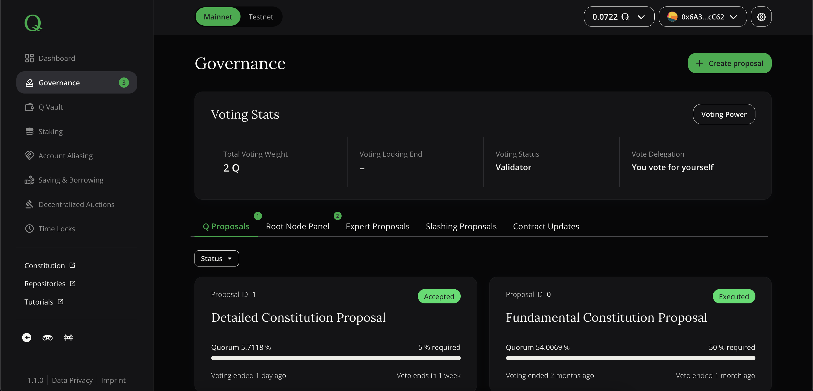

# Governance

Q governance is enforced through proposals that can be voted for or against. Each proposal type has a different lifecycle and stages differ depending on the proposal initiator, voting audience or the overall Q governance structure. This overview checks for all onchain proposals and counts them by separating active (i.e. open) and past (i.e. closed) proposals.

> **Note: ** *In the navigation bar, a number next to "Governance" link indicates the amount of all currently active proposals.*

The governance page has two blocks: voting stats block on the top and proposal tabs block below.

*Screenshot of dApp: Governance*

## Voting Stats

The box "Voting Stats" lists KPIs of the wallet account that is currently connected to the dApp Your HQ.

### Total voting weight

Shows the accumulated amount of Q that will be accounted for in your votes. It includes all Q added to the voting weight within Q Vault [Q Vault](./dapp-qvault.md), all [stakings](./dapp-staking.md) and all [time lock balances](./dapp-timelocks.md).

### Voting Locking End

To mitigate vote manipulation, your voting weight is locked until the last voting period you have voted for has ended. The corresponding time of unlocking is shown here. Until this moment, you can't withdraw or transfer the corresponding Q tokens.

### Voting Status

Shows all relevant voting groups your wallet address is member of. The voting status is used to check elegibility of each participating voter for certain voting types, e.g you can only veto on a proposal if your voting status is "root node".

### Vote Delegation

Your voting weight can be delegated to another Q token holder (see [here](../how-to-exercise-governance-rights/#delegating-voting-power)) who can then vote for or against Q proposals with an aggregated voting weight. The delegation status displayed here shows whether you have delegated or not or if someone else delegated voting power on yourself.

### Voting Power

By clicking on _"Voting Power"_ button on voting stats block top-right corner you will see voting power page. Here you can lock your Q vault tokens for voting or delegate your voting rights to another account.

## Lock Q for Voting

Before you can participate in any governance votings, you need to lock your Q within Q vault to prevent double-votings. The "voting weight" represents the amount of Q that is used to give your vote a weight. The Q locked within Q vault are not the only source increasing voting weight. Delegated voting power or time locks do also increase the aggregated voting weight.

## Delegate Voting power

If you don't plan to participate in governance activities and votings but would like to have your voting weight counted and utilized nevertheless, you can delegate your voting weight to a trusted Q network participant. The field "Current agent" shows who received your delegated voting weight and will thus vote on your behalf.

You can delegate your voting weight by announcing a new voting agent.

  > **Note: ** *If your delegated voting weight was used for a voting by your agent, the according tokens are locked until voting is over.*

## Proposals

Proposals are grouped by type and displayed via card list. Each proposal card contains its identifier, title, status, vote/veto period, and quorum progress.

There is a status filter on each proposal tab. It allows to display only active/ended proposals.

There are 5 types of proposals:

- Q Proposals
- Root Node Panel
- Expert Proposals
- Slashing Proposals
- Contract Updates

## Q Proposals

Changes to the Q system and especially to the Q constitution can be initiated through Q proposals. They are listed on this page and grouped by active and ended proposals. Whereas ended proposals are kept for more general information purposes, active proposals require active participation (i.e. voting) of eligible users.

  > **Note: ** *A number next to Q Proposals in navigation bar indicates the amount of active Q proposals.*

Each proposal will receive a unique and incremental id within its sub-type (e.g. Basic constitution proposal) and is displayed in a separate box. Additional information like remaining voting time or current proposal status are displayed as well.

The proposal details page offers multiple commands that may not all be possible to give at any time (depending on type, status and general context):

  - Share - opens the sharing modal with multiple choices (copy link, post on Twitter/Reddit, etc.)
  - Vote - allows to vote Yes or No (or veto in case of a root node)
  - Execute - successfully *passed* proposals require to be executed onchain before the changes take effect

A click on the button "Create Proposal" on the top right side of the screen opens a modal that will guide you through the process of initiating a proposal.

There are three types of Q proposals:

  1. Constitution Updates - any change to the current constitution (main body and appendices) and its parameters
  2. General Q Update - any change or improvement that helps to improve Q network and community
  3. Emergency Update - any change that requires immediate action to prevent major harm or substantial damage to the system

Each proposal type requires a different set of additional parameters during proposal creation, including references to external information, parameters and their values or a new constitution hash resulting from textual changes. Also, proposal types differ with respect to voting and veto periods and creation and voting permissions (e.g. emergency updates can only be created and voted for by root nodes).

  > **Note: ** *The exact voting procedure including permissions, quorums and time intervals is specified in appendix 5 "Voting" of the [Q constitution](https://q.org/files/Q_Constitution.pdf).*

## Root Node Panel

Adding root nodes to and removing them from the root node panel happens through root node panel proposals. They are listed on this page and grouped by active and ended proposals. Whereas ended proposals are kept for more general information purposes, active proposals require active participation (i.e. voting) of eligible users.

> **Note: ** *A number next to Root Node Panel in navigation bar indicates the amount of active root node panel proposals.*

Each proposal will receive a unique and incremental id within its sub-type (e.g. Root Node Adding Proposal) and is displayed in a separate box. Additional information like remaining voting time or current proposal status are displayed as well.

The proposal details page offers multiple commands that may not all be possible to give at any time (depending on type, status and general context):

  - Share - opens the sharing modal with multiple choices (copy link, post on Twitter/Reddit, etc.)
  - Vote - allows to vote Yes or No (or veto in case of a root node)
  - Execute - successfully *passed* proposals require to be executed onchain before the changes take effect

A click on the button "Create Proposal" on the top right side of the screen opens a modal that will guide you through the process of initiating a proposal.

There are two types of root node panel proposals:

  - Add a new root node - you will propose to add yourself (i.e. apply with your current wallet address) into the root node panel. In step 2, you can optionally select to remove a current root node that you would replace instead. If not selected, the proposal will be to add you as additional root node.
  - Remove a current root node - will start a voting to remove a dedicated root node (requires external URL containing rationale).

If you would like to leave the root node panel yourself, you can initiate a proposal for removing a root node and enter your own wallet address. This will cause an immediate panel exit that doesn't require any vote or veto.

  > **Note: ** *Please check the full [tutorial](../how-to-become-a-root-node) of how to become a root node before initiating a proposal and be aware of appendix 2 of Q constitution (Root Node Selection - Mandatory Requirements). The exact voting procedure including permissions, quorums and time intervals is specified in appendix 5 "Voting" of the [Q constitution](https://q.org/files/Q_Constitution.pdf).*

## Expert Proposals

Some parameters belonging to core Q system or integrated apps are overlooked and managed by expert panels. Parameter and panel management is conducted through expert proposals. They are listed on this page and grouped by active and ended proposals. Whereas ended proposals are kept for more general information purposes, active proposals require active participation (i.e. voting) of eligible users.

> **Note: ** *A number next to Expert Proposals in navigation bar indicates the amount of active expert panel proposals.*

Each proposal will receive a unique and incremental id within its sub-type (e.g. Fees & Incentives Experts membership proposal) and is displayed in a separate box. Additional information like remaining voting time or current proposal status are displayed as well.

The proposal details page offers multiple commands that may not all be possible to give at any time (depending on type, status and general context):

  - Share - opens the sharing modal with multiple choices (copy link, post on Twitter/Reddit, etc.)
  - Vote - allows to vote Yes or No (or veto in case of a root node)
  - Execute - successfully *passed* proposals require to be executed onchain before the changes take effect

A click on the button "Create Proposal" on the top right side of the screen opens a modal that will guide you through the process of initiating a proposal.

There are three types of Q expert panel proposals:

  1. Add a new Expert - Propose a Q address to become part of an expert panel
  2. Remove a current Expert - Initiate a vote about the removal of a specific address from one of the expert panels
  3. Parameter Vote - Propose to change a specific parameter managed by the expert panel you are belonging to

Whereas every Q token holder can initiate a proposal to add or remove an expert, only active experts of the corresponding expert panel can initiate a proposal for changing one or more parameters.

  > **Note: ** *The exact voting procedure including permissions, quorums and time intervals is specified in appendix 5 "Voting" of the [Q constitution](https://q.org/files/Q_Constitution.pdf).*

## Slashing Proposals

When validators or root nodes behave maliciously or in general against the Q constitution, they are subject to slashings that will be initiated and voted for in slashing proposals. They are listed on this page and grouped by active and ended proposals. Whereas ended proposals are kept for more general information purposes, active proposals require active participation (i.e. voting) of eligible users.

> **Note: ** *A number next to Slashing Proposals in navigation bar indicates the amount of active slashing proposals.*

Each proposal will receive a unique and incremental id within its sub-type (e.g. validator slashing proposal) and is displayed in a separate box. Additional information like remaining voting time or current proposal status are displayed as well.

The proposal details page offers multiple commands that may not all be possible to give at any time (depending on type, status and general context):

  - Share - opens the sharing modal with multiple choices (copy link, post on Twitter/Reddit, etc.)
  - Vote - allows to vote Yes or No (or veto in case of a root node)
  - Execute - successfully *passed* proposals require to be executed onchain before the changes take effect

A click on the button "Create Proposal" on the top right side of the screen opens a modal that will guide you through the process of initiating a proposal.

There are two types of slashing proposals:

  1. Root Node Slashing - initiates the voting on the slashing of a root node.
  2. Validator Node slashing - initiates the voting on the slashing of a validator node.

Whereas root node slashing proposals can be created by any Q token holder, validator slashings are initiated and voted only by root nodes. The after successful voting, the slashing is to be executed, resulting in a reduction of the culprits stake. The slashed funds are kept in an escrow, allowing the culprit to take legal countermeasures through private arbitration "Slashing Appeal").

  > **Note: ** *The exact voting procedure including permissions, quorums and time intervals is specified in appendix 5 "Voting" of the [Q constitution](https://q.org/files/Q_Constitution.pdf). The exact process of slashing, slashing objection and arbitration is defined in articles 6 & 13.*
