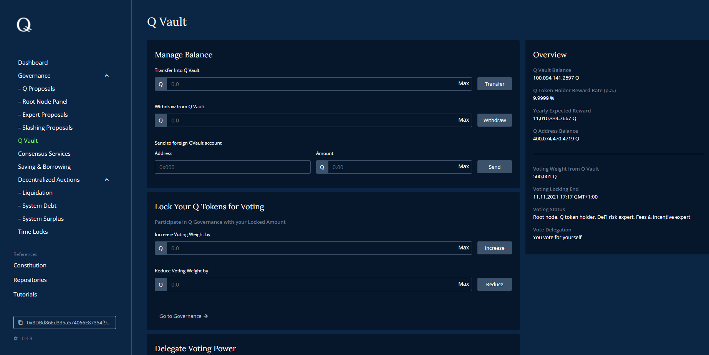

# Q Vault

You can of course leave your Q token on your wallet alone, but the Q vault opens up a variety of opportunities to utilize your Q assets, that is:

- Earn rewards on Q token deposits (see [here](how-to-earn-extra-Q-tokens.md) for more details)
- Lock tokens for voting (see [here](how-to-exercise-governance-rights.md) for more details)
- Delegate voting power (see [here](how-to-exercise-governance-rights.md) for more details)
- Delegate staking power and earn delegation rewards (see [here](how-to-delegate-to-validator.md) for more details)

*Screenshot of dApp: Q Vault*

## Manage Balance

Before using Q tokens for above mentioned activities, they need to be transferred into the Q vault using the first form field by entering the desired amount and clicking on "Transfer". Withdrawable funds can be taken out of the vault accordingly.

  > **Note: ** *You need to have some remaining Q fractals to pay future transaction fees (gas). Please ensure that you don't transfer the maximum amount into Q vault!*

If you want to transfer Q tokens to another wallet address, you don't need to withdraw them first. Instead, you can use the function to send "from Q vault to Q vault" by entering the recipient address and amount to be sent.

## Lock Your Q Tokens for Voting

Before you can participate in any governance votings, you need to lock your Q within Q vault to prevent double-votings. The "voting weight" represents the amount of Q that is used to give your vote a weight. The Q locked within Q vault are not the only source increasing voting weight. Delegated voting power or time locks do also increase the aggregated voting weight.

## Delegate Voting power

If you don't plan to participate in governance activities and votings but would like to have your voting weight counted and utilized nevertheless, you can delegate your voting weight to a trusted Q network participant. The field "Received weight" shows active delegations on your address, "Current agent" shows who received your delegated voting weight and will thus vote on your behalf.

You can delegate your voting weight by announcing a new voting agent.

  > **Note: ** *If your delegated voting weight was used for a voting by your agent, the according tokens are locked until voting is over.*

## Delegate Staking Power

Validator receive their reward based on the stake they have put onto their validator nodes address. By delegating Q, any Q token holder can increase a validator nodes stake and, if the validator manages correctly his staker reward pool, earn a defined share of validation reward.

Delegation happens by entering address and amount of Q you want to delegate. You can have multiple delegations and thus earn delegation rewards by several validators. Rewards need to be claimed. The value "Outstanding Delegation Rewards" shows the claimable amount that was collected within each validators stake delegation pool.

> **Note: ** *Delegated stake is at risk of being slashed if the validator misbehaves and gets slashed by the Q root nodes.*

## Overview

The overview box shows relevant KPIs of your wallet address in context with Q vault.

- Q Vault Balance - the overall balance of funds within Q vault
- Q Token Holder Reward Rate (p.a.) - yearly reward rate that will be earned by Q vault balance
- Yearly Expected Reward - Estimate based on actual balance and yearly token holder reward rate
- Q Address Balance - balance of connected wallet account (i.e. MetaMask account)

  > **Note: ** *Q reward rates are based on compound rate approach, meaning that rewards are calculated and aggregated until a transaction (e.g. a withdrawal) triggers a compound rate update combined with a reward pay-out. This implies that rates might change over time and reward estimates will be more imprecise the longer the time interval for estimation is and the more triggering transactions happen.*

  Underneath the monetary KPIs, you can see values around voting weight and their appropriate locking periods. The "Voting Status" indicates the roles and voting permissions your connected address has and "Vote Delegation" shows whether you have delegated your voting weight.
