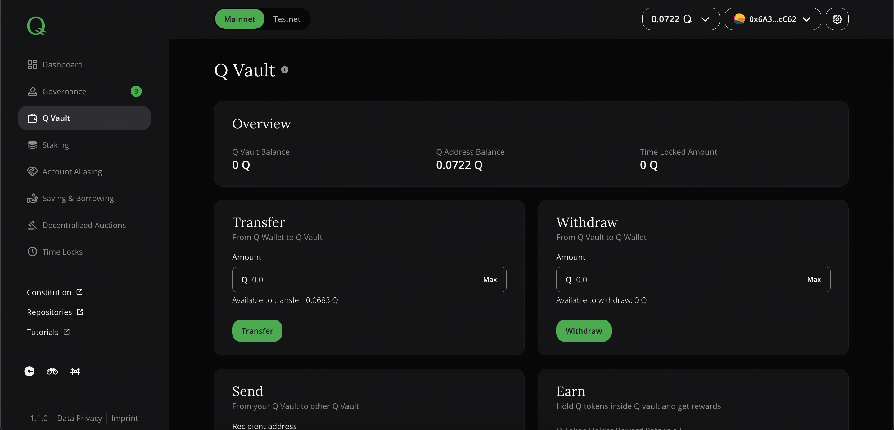

# Q Vault

You can of course leave your Q token on your wallet alone, but the Q vault opens up a variety of opportunities to utilize your Q assets, that is:

- Earn rewards on Q token deposits (see [here](../how-to-earn-extra-Q-tokens) for more details)
- Lock tokens for voting (see [here](../how-to-exercise-governance-rights) for more details)
- Delegate voting power (see [here](../how-to-exercise-governance-rights) for more details)
- Delegate staking power and earn delegation rewards (see [here](../how-to-delegate-to-validator) for more details)

Q vault page consists of overview block and four action blocks: Transfer, Withdraw, Send, and Earn.

*Screenshot of dApp: Q Vault*

## Overview

The overview box shows relevant KPIs of your wallet address in context with Q vault.

- Q Vault Balance - the overall balance of funds within Q vault
- Q Address Balance - balance of connected wallet account (i.e. MetaMask account)
- Time Locked Amount - currently locked Q vault balance

## Transfer

Before using Q tokens for above mentioned activities, they need to be transferred into the Q vault using the first form field by entering the desired amount and clicking on "Transfer".

  > **Note: ** *You need to have some remaining Q fractals to pay future transaction fees (gas). Please ensure that you don't transfer the maximum amount into Q vault!*

## Withdraw

To withdraw your funds from the Q vault enter the desired amount and click on "Withdraw button".

  > **Note: ** *You cannot withdraw currently time locked Q tokens inside your Q vault. You should wait until they are fully unlocked*

## Send

If you want to transfer Q tokens to another wallet address, you don't need to withdraw them first. Instead, you can use the function to send "from your Q Vault to other Q Vault" by entering the recipient address and amount to be sent.

## Earn

By holding your Q tokens inside Q vault you are eligible to get Q Token Holder Rewards.

Earn block shows relevant KPIs for Q token holding rewards:

- Q Token Holder Reward Rate (p.a.) - yearly reward rate that will be earned by Q vault balance
- Yearly Expected Reward - Estimate based on actual balance and yearly token holder reward rate
- Q Token holder reward updated - Last time when rewards were allocated

You can allocate rewards by clicking on "Allocate rewards" button and confirming transaction in MetaMask.

  > **Note: ** *Q reward rates are based on compound rate approach, meaning that rewards are calculated and aggregated until a transaction (e.g. a withdrawal) triggers a compound rate update combined with a reward pay-out. This implies that rates might change over time and reward estimates will be more imprecise the longer the time interval for estimation is and the more triggering transactions happen.*

  Underneath the monetary KPIs, you can see values around voting weight and their appropriate locking periods. The "Voting Status" indicates the roles and voting permissions your connected address has and "Vote Delegation" shows whether you have delegated your voting weight.
