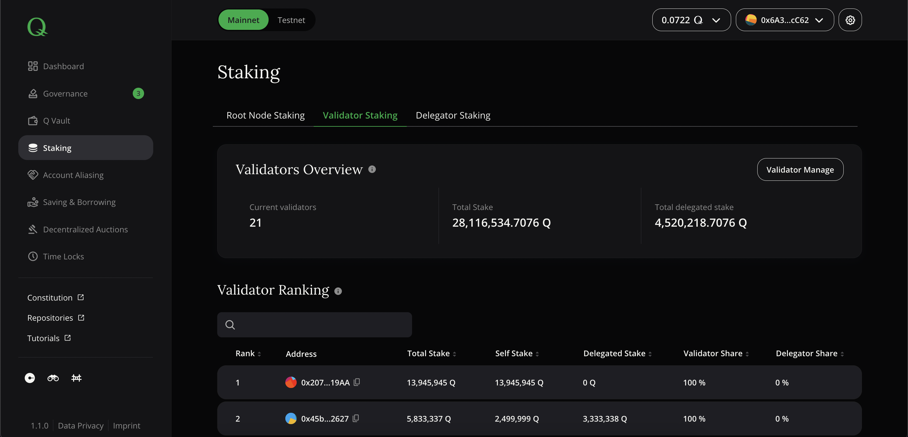

# Staking

This dApp section is used by root nodes and validator nodes to manage their stake and staker reward pool (validators only). Also there's ability to delegate staking power to 

*Screenshot of dApp: Staking - Validator Staking*

## Root Node Staking

Root node operators can transfer Q tokens to their root node stake. In general, both root node and validator stake are at risk of being slashed in case the node operator behaved against the rules of Q as defined in Q constitution. Being the "watchmen" of Q constitution, root nodes can show their commitment through a high stake since there is no monetary incentive for them that is connected to the amount of stake. A high stake only identifies them as being committed and shows their "skin-in-the-game".

The balance overview in "Root Node Staking" shows stake and Q wallet balance as well as time locked root node stake. Before a root node is able to withdraw stake, an announcement of the same is required. After the announcement period has ended, the announced funds can be withdrawn. This is a security feature for Q token holders and the network in order to be prepared for unexpected exit scenarios of trusted network members.

## Validator Staking

Validators need to put stake on their validator staking balance in order to enter the validator shortlist. Only members of the validator shortlist are allowed to validate transactions and mine blocks. The validator ranking is ordered by total accountable stake descending, meaning the validator with most accountable stake is on position 1, the validator with second most stake is on position 2 etc.

The balance overview in "Validator Staking" shows stake and Q wallet balance as well as time locked validator stake. Before a validator is able to withdraw stake, an announcement of the same is required. After the announcement period has ended, the announced funds can be withdrawn. This is a security feature for Q token holders, stake delegators and the network to be prepared for unexpected exit scenarios of trusted network members.

The validator ranking table gives potential delegators an overview of each validators performance. Especially "Delegator Share" (i.e. share that will be rewarded to delegators) and "Delegation Efficiency" (i.e. degree of impact of every additionally delegated Q) are indicators for economically efficient [delegations](how-to-delegate-to-validator.md).

Clicking on the button "Manage Staker Reward Pool" on the top right corner of the screen opens a modal that allows validators to define the share the group of delegators receive when they delegate stake to the according validator node. There are different types of stake:

  - Total Stake: Validator Own Stake + Delegated Stake
  - Validator Stake: All Q tokens that have been staked by the validator himself
  - Delegated Stake: All Q tokens that have been delegated by others than the validators
  - Accountable Stake: Stake counting in validator ranking. To prevent validators to self stake 1Q and put 1Mio Q into the Q vault and delegate to themselves, a factor determines the maximum accountable stake based on self-stake. This factor is managed by parameter `governed.EPQFI.stakeDelegationFactor`. Assuming it is 10, the accountable total stake for a validator cannot be more than 10 times his self stake.

The option to refresh user delegations will trigger a distribution of collected rewards by the reward pool so far.

The lower section "Reward Stats" show the following pool details:

  - Collected Pool Rewards: Q tokens collected since last reward allocation that will be distributed
  - Outstanding Delegator Claims: Reward share that is unclaimed by delegators
  - Distributable Delegator Rewards: Rewards that are to be distributed amongst all delegators
  - Distributable Delegator Percentage: Percentage of all rewards to be distributed among all delegators
  - Validator Share: Share of validation rewards that the validator takes for himself
  - Delegator Share: Share of validation rewards that the validator is willing to distribute among all delegators

A validator may set a new delegator share at the bottom of the modal. The bigger the share for delegators, the smaller the share for the validator but the higher the chance of attracting new delegators.

  > **Note: ** *Unlike validators, root nodes earn rewards based on their panel membership in a non-pro-rata approach. This is the reason why stake delegation is not available for root nodes, thus management of a staker reward pool is only possible for validators.*

## Delegator Staking

Validator receive their reward based on the stake they have put onto their validator nodes address. By delegating Q, any Q token holder can increase a validator nodes stake and, if the validator manages correctly his staker reward pool, earn a defined share of validation reward.

Delegation happens by choosing/entering validator address and amount of Q you want to delegate. You can have multiple delegations and thus earn delegation rewards by several validators. Rewards need to be claimed. The value "Outstanding Delegation Rewards" shows the claimable amount that was collected within each validators stake delegation pool.

> **Note: ** *Delegated stake is NOT at risk of being slashed if the validator misbehaves and gets slashed by the Q root nodes.*
