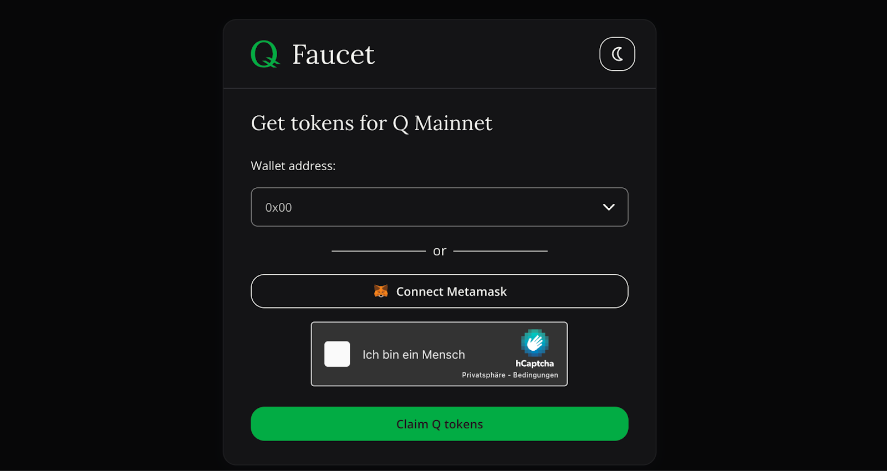
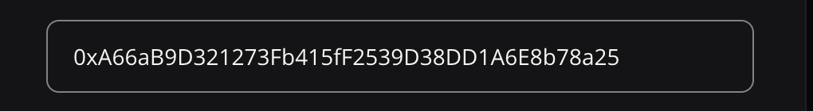
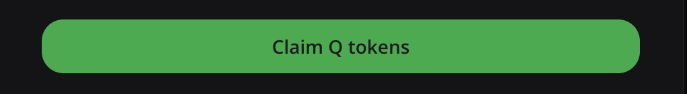

# Claim Q Tokens from the Mainnet Faucet

To get started with the Q Blockchain, you can claim Q Tokens from the Mainnet Faucet. Q tokens can be used for various purposes, such as sending them to friends, interacting with governance systems on Q, or deploying code.

**To use the faucet, follow the steps below:**

1. Visit the faucet at [https://faucet.q.org](https://faucet.q.org/)
2. Paste an (EVM) address in the respective field OR connect your wallet using Metamask

3. Click on “I am human“ and solve the Captcha

4. Click on "Claim Q Tokens“

5. Q Tokens will be sent to the wallet you provided.

**Here is a video tutorial on using the Q Mainnet Faucet:**

<iframe width="560" height="315" src="https://www.youtube.com/embed/dhjDbbtxw0o" frameborder="0" allow="accelerometer; autoplay; encrypted-media; gyroscope; picture-in-picture" allowfullscreen></iframe>
 
 

Besides the steps described above, a few conditions have do be met for successfully claiming tokens from the Faucet:

- Using the faucet is possible only once per address within 24 h
- The provided wallet needs a „non-zero“ balance on the Ethereum Mainnet. That means you need to hold at least some Ethereum dust.
- The balance of the provided wallet needs to be below 1 Q on Q Mainnet.
- The daily supply of tokens to the faucet is limited. If there are no more tokens in the faucet, please wait for a refill. 

To support the Faucet, you can donate Q Tokens directly to the faucet at: `0x5A3F5728C3b7ACFbc1C658F6b42A4e05eC00E688`