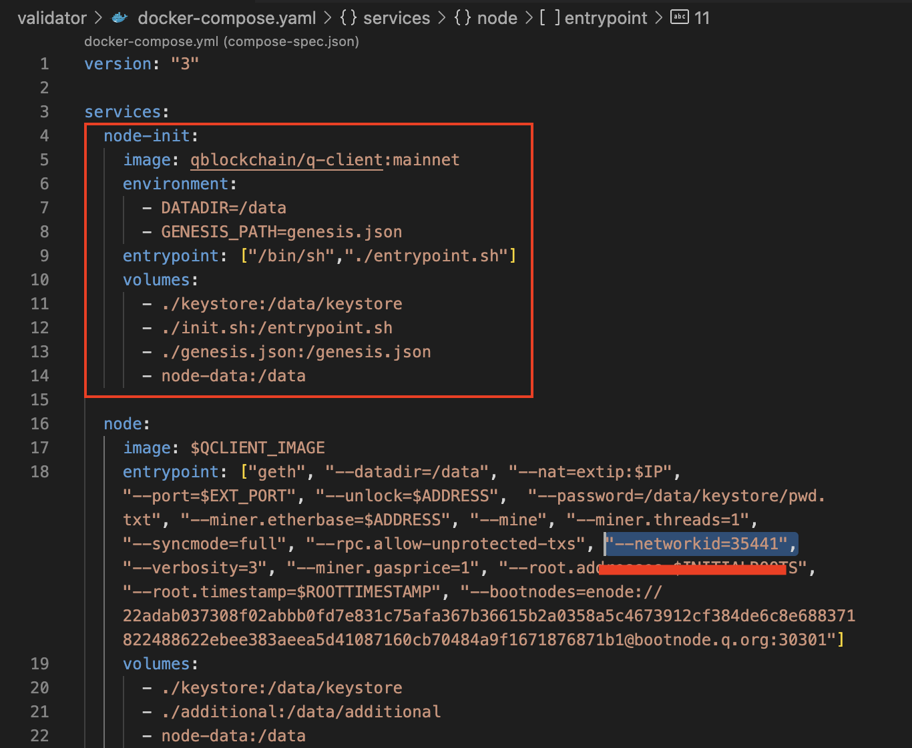

# Updating Q-Client & Docker Images

In case of severe updates of the Q-Client, you will be required to update the validator files and configs.
To do so, within directory `/validator` (for validator), `/rootnode` (for rootnode) or `/fullnode` (for fullnode),
use the following commands.

## Check your docker-compose.yaml

If you set up your node on the early stages your config can be outdated. To keep it up-to-date without
pulling new releases of the mainnet-public-tools check your **docker-compose.yaml** file and modify it if necessary:

- remove **node-init** service
- remove **"--network=35441"** flag (don't forget to remove comma after it also)
  

## Update Q-client image

- **Change the docker image directly in your **.env** file:**

```
...
QCLIENT_IMAGE=qblockchain/q-client:v1.3.6
...
```
> **_NOTE:_**  the tag naming convention has been changed to include a v in the version tag. So, make sure to enter "...q-client:v1.3.6".

- **Pull (and overwrite) the latest docker image**

```bash
$ docker-compose pull
```

- **Restart with new configs & images**

```bash
$ docker-compose down -t 60 && docker-compose up -d
```

Now your validator node should restart and synchronise with the mainnet again.
