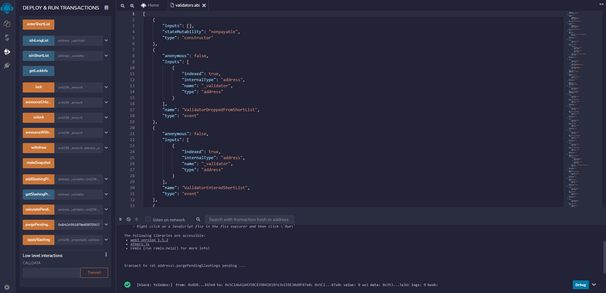

# How to purge Validator node slashings

As a security and anti-spam protection feature, a root node is only allowed to purge the same validator once. In order to slash the same validator again, the according root node needs to purge all his slashing transactions. This is done through the function `purgePendingSlashings` in contract `validators.sol`.

## Basic concept using Remix

Since the `purgePendingSlashings` function is not implemented in Your HQ dApp, root nodes need to directly interact with the smart contract. One easy way is using [Remix](how_to_interact_with_smart_contracts_with_remix.md).

## Abi file and contract address

The according contract abi file can be imported from [`testnet-public-tools`](https://gitlab.com/q-dev/testnet-public-tools/-/tree/master/abi).

The contract address for `governance.validators` can be retrieved from your [HQ dApp parameter list](https://hq.qtestnet.org/q-parameters)

## Purge function

Once you have selected the abi file and use your root node address for an injected web3 call to the  `governance.validators` contract, you can see the list of functions available.

Add the address of the validator node to be slashed as input parameter for `purgePendingSlashings` function and execute the transaction. After successful processing, you are able to initiate a new validator slashing with the according root node.

*Screenshot of Remix after successful purge transaction*
