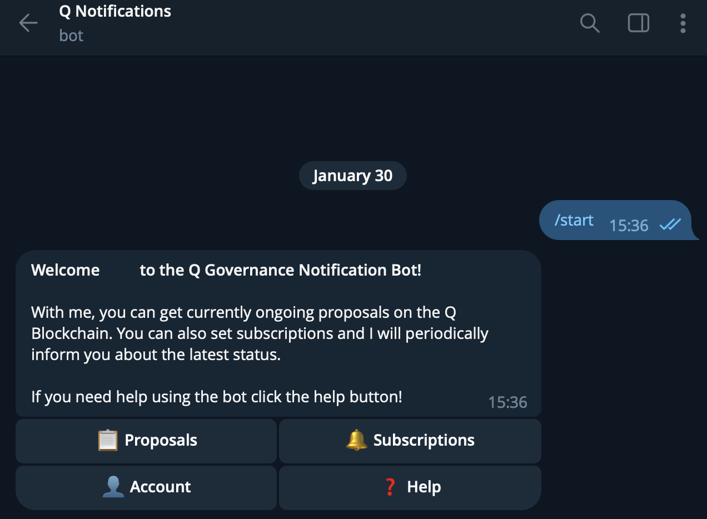

# Q Notification Service

Being up to date about ongoing votings and governance decisions on Q is crucial for a vital and healthy community. Don't miss any newly created proposal, pull voting stats on your favorite proposal types or setup an alert for proposals that contain your own address (e.g. slashing proposals, expert adding or removal,.. ) with the *Q notification service* on Telegram. This short tutorial will show you how to connect to the notification service on `Q mainnet`.

## Install Telegram Messenger

The Q notification service is integrated into Telegram messenger. This tutorial uses the Windows desktop version of Telegram as reference, but you can use any official Telegram client (iOS, MacOS, Android,..) as well.

## Connect to Notification Service Bot

Open Notification service by following the link: [https://t.me/QNotificationsBot](https://t.me/QNotificationsBot). 

You can also search for name `Q Notifications Bot` or ID `@QNotificationsBot` in Telegram and click on the result.

Once you opened the notification service, click "Start" to connect to it and thus start interacting with it.

## Notification Service Menu

The main menu shows current proposals and allows to configure subscriptions on specific proposal types or set up alerts for up to 3 wallet addresses.

*Telegram: Q Notification Service Main menu*

| **Menu Item** | **Meaning** |
|:--|:--|
| 📋 Proposals | Select a specific proposal type and the bot will show you currently active proposals accordingly. |
| 🔔 Subscriptions | Set proposal types for which the bot will provide daily updates. Simply click on the specific proposal type and it will toggle your subscription on or off. You can also see a list of your current subscriptions and you can reset all your subscriptions to default (off). |
| 👤 Account | Attach up to 5 of your Q addresses. It allows you to see how you voted in proposals list. The bot will inform you in case your address will be a slashing target as well. Besides, you can change the bot language and clear account data. |
| ❓ Help | Get some basic explanation on how the notification service works. |
