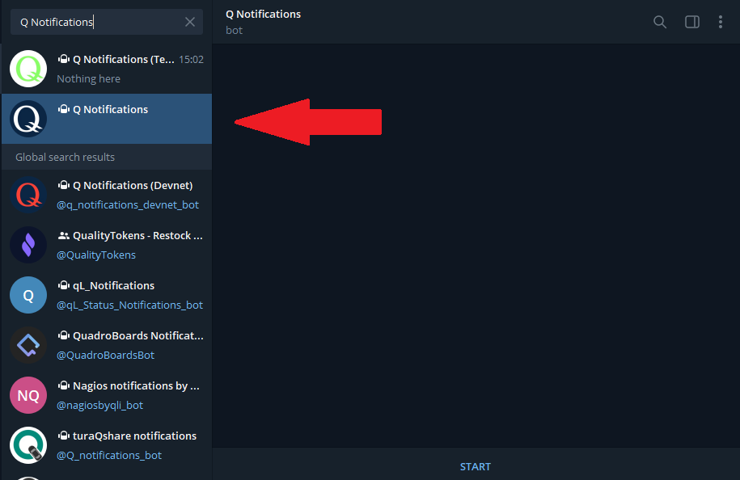
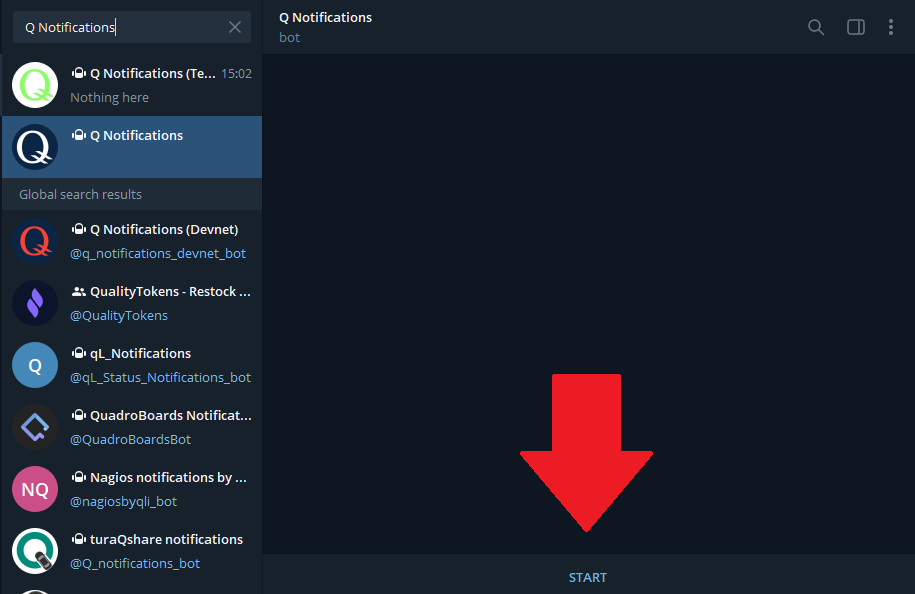

# Q Notification Service

Being up to date about ongoing votings and governance decisions on Q is crucial for a vital and healthy community. Don't miss any newly created proposal, pull voting stats on your favorite proposal types or setup an alert for proposals that contain your own address (e.g. slashing proposals, expert adding or removal,.. ) with the *Q notification service* on Telegram. This short tutorial will show you how to connect to the notification service on `Q mainnet`.

## Install Telegram Messenger

The Q notification service is integrated into Telegram messenger. This tutorial uses the Windows desktop version of Telegram as reference, but you can use any official Telegram client (iOS, MacOS, Android,..) as well.

## Search for Q Notifications

Within Telegram, go to the search bar for finding new contacts and either enter the name or the telegram handle:

*Telegram: Search for Q Notifications*

Name: `Q Notifications` or

Handle: `@notifications_q_bot`

## Connect to Notification Service Bot

If you selected the notification service in the search result area, you will be able to connect to it and thus start interacting with it.

*Telegram: Connecting with Q Notification Service*

## Notification Service Menu

The main menu shows current proposals and allows to configure subscriptions on specific proposal types or set up alerts for up to 3 wallet addresses.

*Telegram: Q Notification Service Main menu*

| **Menu Item** | **Meaning** |
|:--|:--|
| See proposals list | Opens a sub-menu that allows to select a specific proposal type and lists all active proposals. |
| Subscriptions | Opens a sub-menu that allows to (un-) subscribe to a specific proposal type. For every subscription, you will be notified once a new proposal is created. |
| Help | Get some basic explanation on how the notification service works. |
| Update your Q address | You will be prompted to enter a wallet address and thus create an account. You will get a notification whenever a proposal is created using this address (e.g. slashing proposals). You can enter up to 3 addresses per account. |
| Show user addresses | Get a list of all Q addresses that are subject to an alert. |
| Delete your account | Removes previously entered addresses and the according account. |
