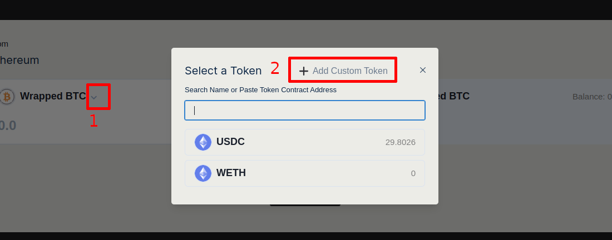
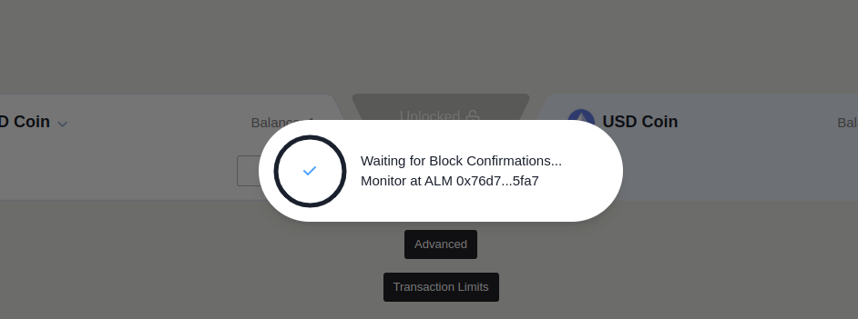
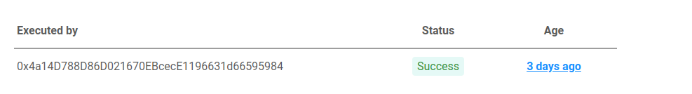
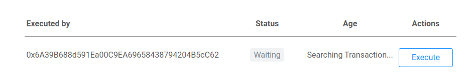
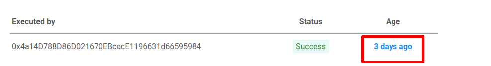
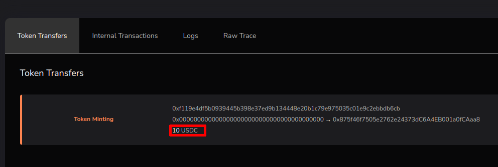
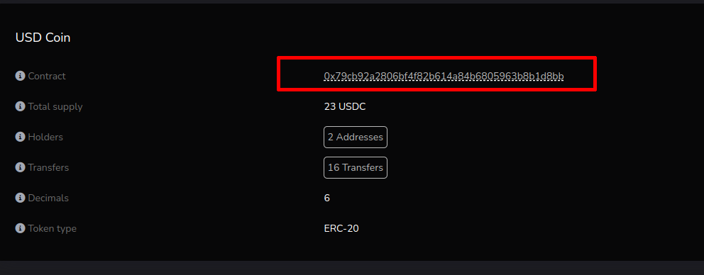
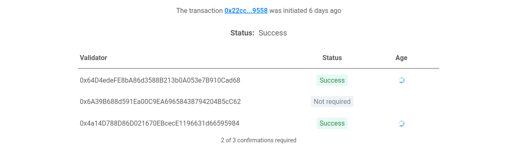
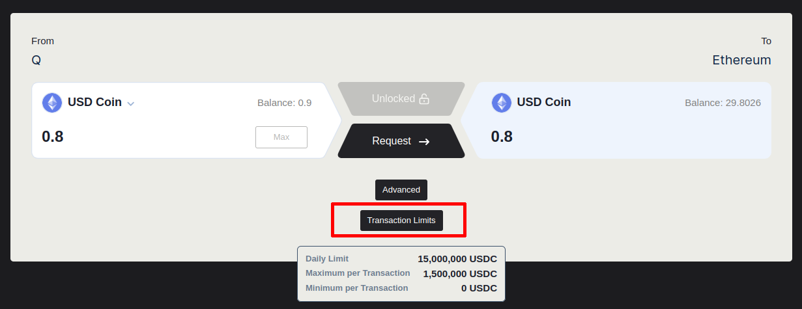

# Q Bridge

## What is Q Bridge

The [Q bridge](https://bridge.q.org/) allows user to transfer ERC20 tokens between Q and other blockchain networks.
However, the current Mainnet bridge only supports transfers from/to Ethereum Mainnet. Other networks might be added in the future.

## How to use

### Select network

Go to [bridge.q.org](https://bridge.q.org/)  then choose the network you want to bridge from. This will be done from your wallet app. After selecting the network the page should refresh.

### Select token asset

To select the asset you want to bridge, click on the dropdown near the current asset name.

If the asset you are looking for is not on the list, then choose “custom token” and paste the hexadecimal contract address of the token.

> As the bridge only supports ERC20 tokens, you cannot transfer native Ether tokens directly. Instead, you will have to swap ETH for Wrapped Ether and transfer those.

### Bridge Asset

Click on “Transfer” then confirm transaction with your wallet app.
A popup window will open displaying your transaction hash.
Click on it to access the monitoring app and monitor your transaction status.

> You can also paste the transaction hash on the search bar of the [monitoring](https://alm.q.org/) app.

### Bridge from foreign chain to Q

When enough validators have confirmed, one of them will execute the transaction, and the app will show a “success” status and the transaction details at the bottom of the page.

### Bridge from Q to foreign chain

When bridging the other way around, you have to execute the final transaction by yourself on the foreign chain, by clicking the “execute” button and then confirming the transaction on your wallet app. This implies that you will need to possess enough Q tokens, but also natives token from the foreign blockchain (for example ETH on ethereum).

## Add bridged token to wallet

On the monitoring app, under “Executed by”, click on the transaction age to open the Q explorer and access transaction details.
Under the token transfer section will be shown the token symbol and amount of transfer.
Click on the token symbol to open the token contract page. From there, copy the contract address and add it to your wallet app.

## Troubleshooting

## You don't have enough tokens to pay for gas

Native tokens are required to pay for transaction gas fees.
For example, if you want to bridge USDC tokens from Ethereum to Q, you will need USDC and ETH tokens.

> Note that when bridging from Q to Ethereum, you will also need to possess ETH to execute the final transaction.

## Validators are out of funds

If the confirmation are failing to succeed on the monitoring app, it could be a hint that validators are running out of funds and therefore, cannot confirm the transactions.
Validators balances are monitored in principle, and therefore such problem should be resolved quickly. However, if the issue is still persisting, you can alert the community on discord.

## Bridge transaction limits

There are several limits on the bridge transactions : daily limit, transaction maximum amount and transaction minimum amount.

Click on "transaction limits" to access the current values of the transaction limits.

## Issue with the bridged asset

If you are bridging an exotic asset that is ERC20 compliant but has whitelist/blacklist or extra logic for transfer, such as fees, it could cause issues with bridging.