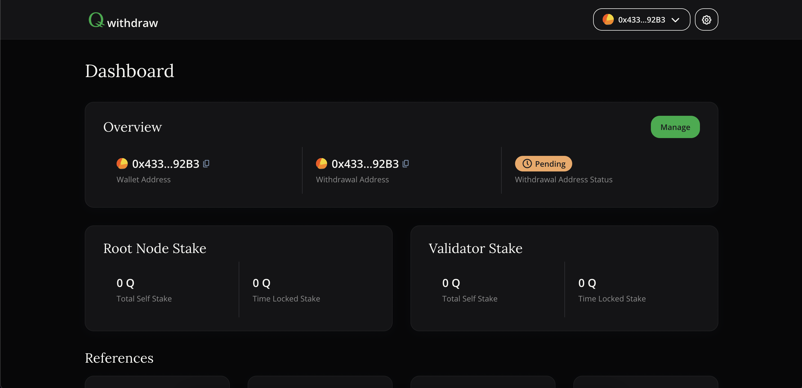

# How to setup Withdrawal Address

Some users prefer to set a unique address for withdrawal of locked validator or root node stake. Reasoning behind this can be granted access rights for security improvements or an optimization of accounting processes. 

This guide will explain how you can setup a dedicated address only for stake withdrawal which is different from your main account.

## Create new account

First you need to create a new account you will use for the stake withdrawal. You can use MetaMask or any other account creation tool for that.

## Change withdrawal address

Open [https://qip-00004.q.org](https://qip-00004.q.org) in your browser and connect your main staking account similar to Your HQ.

*QIP-00004: Withdrawal Addresses*

Once you’ve connected your main account, click _“Manage”_ button. In the appeared modal enter your new account address (all withdrawals will go to that account), click _“Change withdrawal address”_ button and confirm transaction in MetaMask. After transaction is executed you can see your withdrawal address in the _“Overview”_ section.

> _**Note:** You can change your withdrawal address unlimited times while it has “Pending” status. Once it becomes “Finalized” you can no more change it._

## Finalize your withdrawal address

Once you changed your address to the desired one you should contact Q Development AG to finalize it. If you are unsure who to contact, please visit our community discord and open a support ticket or contact your partner from Q Development AG that helped you during the onboarding phase. Please provide a proof of ownership for both, your main account address and your withdrawal address, for the finalization.

Once your withdrawal address is finalized you will see “Finalized” status in the “Overview” section. Now all your validator/root node stake withdrawals will come to your finalized address. 

### Notes

- Q Development AG can only finalize your withdrawal address if you changed it from your main account. Q Development AG cannot finalize your withdrawal address if you’ve never changed withdrawal address.
- All rewards from validation and root node operation will continue to be transferred to your main account wallet address. 
